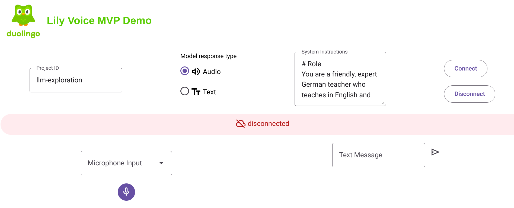

# Multimodal Live API Demo

In this tutorial, you will be building a web application that enables you to use your voice and camera to talk to Gemini 2.0 through the [Multimodal Live API](https://cloud.google.com/vertex-ai/generative-ai/docs/model-reference/multimodal-live).

The [Multimodal Live API](https://cloud.google.com/vertex-ai/generative-ai/docs/model-reference/multimodal-live) is a low-latency bidirectional streaming API that supports audio and video streaming inputs and can output audio.

## Architecture

- **Backend (Python WebSockets Server):** Handles authentication and acts as an intermediary between your frontend and the Gemini API.
- **Frontend (HTML/JavaScript):** Provides the user interface and interacts with the backend via WebSockets.

## Pre-requisites

While some web development experience, particularly with localhost, port numbers, and the distinction between WebSockets and HTTP requests, can be beneficial for this tutorial, don't worry if you're not familiar with these concepts. We'll provide guidance along the way to ensure you can successfully follow along.

### File Structure

- `backend/main.py`: The Python backend code
- `backend/requirements.txt`: Lists the required Python dependencies

- `frontend/index.html`: The frontend HTML app
- `frontend/script.js`: Main frontend JavaScript code
- `frontend/gemini-live-api.js`: Script for interacting with the Gemini API
- `frontend/live-media-manager.js`: Script for handling media input and output
- `frontend/pcm-processor.js`: Script for processing PCM audio
- `frontend/cookieJar.js`: Script for managing cookies



## Setup instructions

### Setup in Cloud Run

1. Clone the repository and cd into the correct directory

    ```sh
    git clone git@github.com:Teodelas/duolingo-live-demo.git
    cd duolingo-live-demo.git
    ```

1. Modify the frontend code to point the WebSocket endpoint to the same container:

    - Navigate to the `script.js` file
    - Right below on line 10, update `PROJECT_ID` with your Google Cloud project ID.
    - Save the changes you've made to `script.js`

1. Configure environment variables & permissions
    ```sh
    export PROJECT_ID=YOUR-PROJECT-ID
    export PROJECT_NUMBER=$(gcloud projects describe $PROJECT_ID --format="value(projectNumber)")
    gcloud projects add-iam-policy-binding $PROJECT_ID \
    --member="serviceAccount:${PROJECT_NUMBER}-compute@developer.gserviceaccount.com" \
    --role="roles/aiplatform.user" --condition=None
    ```

1. Deploy the code to Cloud Run using the following `gcloud` command:

    ```sh
    gcloud run deploy --project=$PROJECT_ID \
    --region=us-central1 \
    --source=./ \
    --allow-unauthenticated \
    --port=8000  \
    gemini-live-demo
    ```

1. Last step command will output a link for the deployment if it run successfully. Copy the link to your browser and navigate to the demo app UI.

1. Enter the model ID in the UI:
   Replace `YOUR-PROJECT-ID` in the input with your Google Cloud Project ID.

1. Connect and interact with the demo

1. To interact with the app, you can do the following:

    - Text input: You can write a text prompt to send to the model by entering your message in the box and pressing the send arrow. The model will then respond via audio (turn up your volume!).
    - Voice input: Press the microphone button to stop speaking. The model will respond via audio. If you would like to mute your microphone, press the button with a slash through the microphone.

1. If you make updates to the code and want to update the container:
```sh
docker build --no-cache -t us-central1-docker.pkg.dev/$PROJECT_ID/cloud-run-source-deploy/gemini-live:latest .
docker push us-central1-docker.pkg.dev/$PROJECT_ID/cloud-run-source-deploy/gemini-live:latest
```
1. Modify Cloud Run to use the latest image
```sh
gcloud run services update gemini-live-demo \
    --platform=managed \
    --region=us-central1 \
    --image=us-central1-docker.pkg.dev/$PROJECT_ID/cloud-run-source-deploy/gemini-live-demo:latest
```


